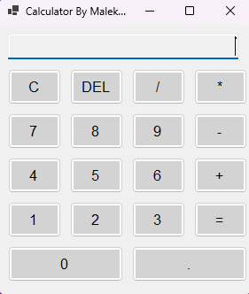

# C# Calculator

A simple yet functional Windows Forms calculator application built with C#.

## Features

- Basic arithmetic operations (+, -, *, /)
- Clear (C) and Delete (DEL) functionality
- Decimal point support
- Error handling for invalid operations
- Clean and intuitive user interface

## Screenshots

## Getting Started

### Prerequisites

- .NET 8.0 SDK or later
- Visual Studio 2019 or later (recommended)

### Installation

1. Clone the repository
